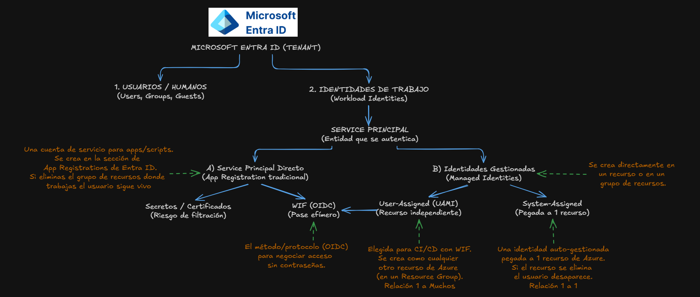
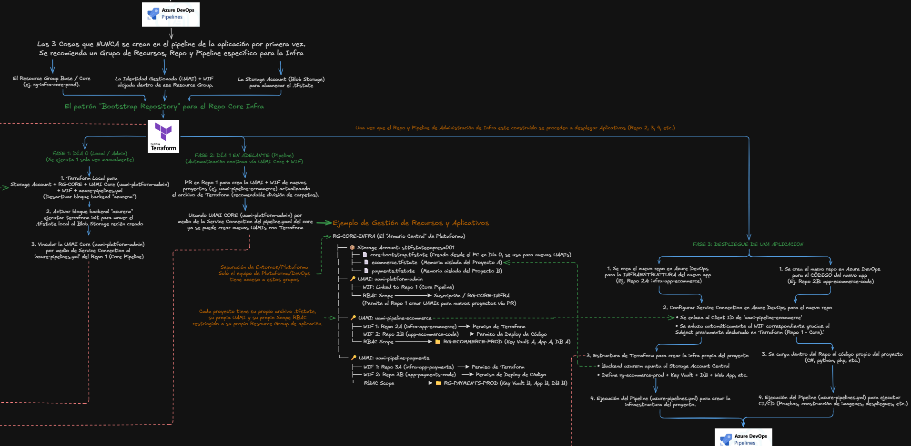
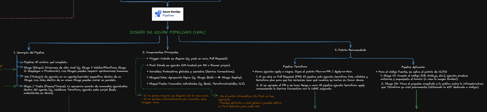
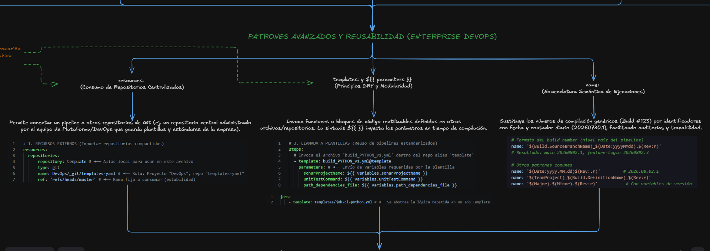
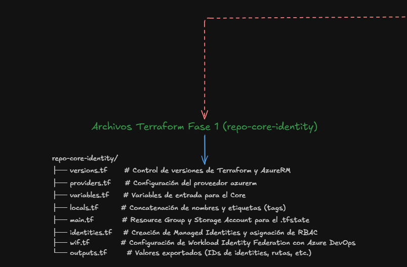
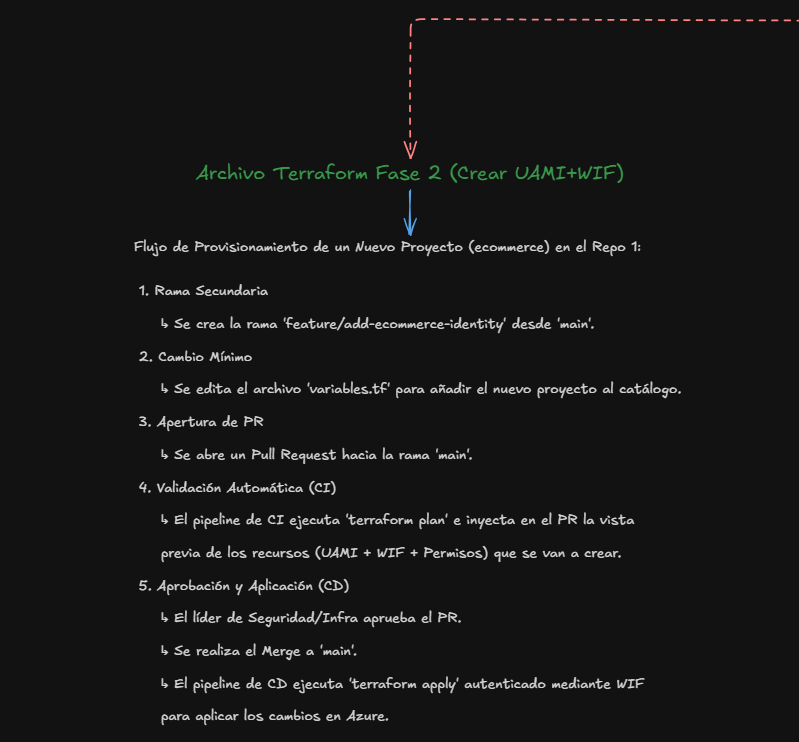
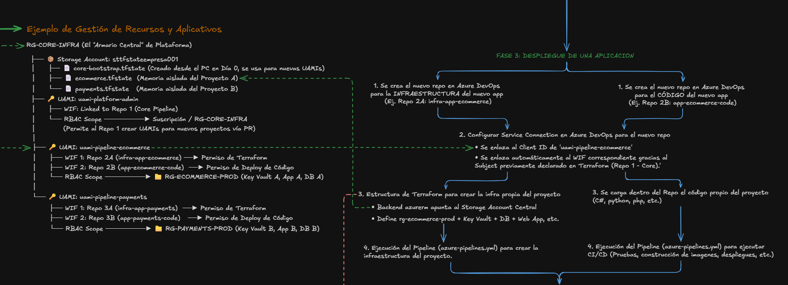
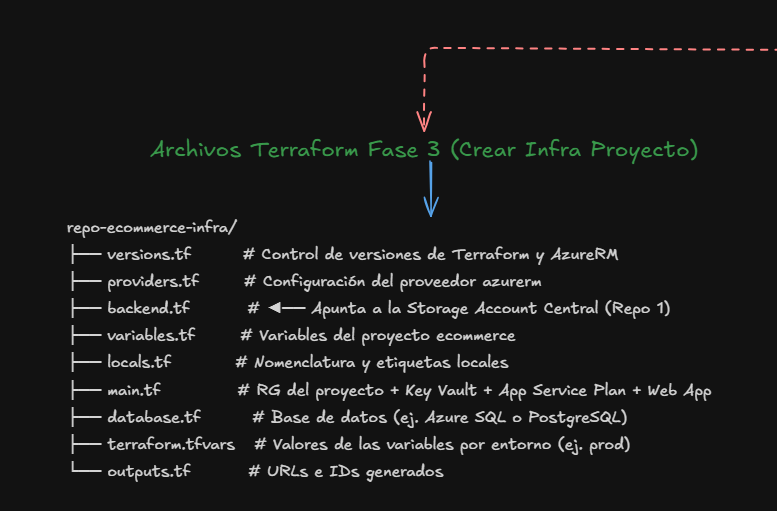

# 🛡️ Azure DevOps Enterprise Governance & CI/CD Architecture

Este repositorio es una **Prueba de Concepto (PoC)** que demuestra la implementación de una arquitectura Enterprise orientada a **DevOps Engineering** en Azure. 

El objetivo principal es ilustrar cómo gobernar el ciclo de vida completo de proyectos y aplicaciones utilizando **Infraestructura como Código (IaC)**, seguridad sin contraseñas mediante **Workload Identity Federation (WIF)** y pipelines **CI/CD estandarizados**.

---

## 🧠 Teoría y Fundamentos Arquitectónicos

Para diseñar una infraestructura escalable y segura, este proyecto se fundamenta en tres pilares clave:

### 1. Gestión de Identidades (Microsoft Entra ID)
Evitamos el uso de Service Principals tradicionales basados en secretos o certificados debido al alto riesgo de filtración. En su lugar, utilizamos el método **Workload Identity Federation (WIF)**, el cual emplea el protocolo OIDC para negociar accesos sin necesidad de contraseñas mediante pases efímeros. 

* Para los pipelines de CI/CD, implementamos **User-Assigned Managed Identities (UAMI)**, ya que son recursos independientes (Relación 1 a Muchos) ideales para este propósito.

### 2. El Patrón "Bootstrap Repository" (Separación de Responsabilidades)
Para evitar riesgos críticos, estructuramos la creación de infraestructura en un flujo de tres fases estables:

* **El Armario Central:** Un Resource Group base (Core) almacena de forma segura los archivos `.tfstate` (memoria aislada) de todos los proyectos de la empresa.
* **Aislamiento por Proyecto:** Cada aplicación (ej. *ecommerce*, *payments*) recibe su propia UAMI con permisos (RBAC Scope) limitados estrictamente a su propio Resource Group.

### 3. Diseño de Azure Pipelines (YAML)
Los pipelines siguen una jerarquía estricta y descendente: `Pipeline -> Stage -> Job -> Steps/Tasks`.

* **Infraestructura (Terraform):** Nunca aplicamos cambios a ciegas. Implementamos el patrón *Plan-on-PR / Apply-on-Main*. Al abrir un Pull Request, el pipeline ejecuta `terraform plan` para validación visual; al aprobarse (Merge), se ejecuta `terraform apply` consumiendo la Service Connection.
* **Aplicación:** Dividimos el proceso en CI (compilación y pruebas) y CD (despliegue usando la infraestructura previamente creada).

---

## 🏗️ Flujo de Trabajo y Estructura del Repositorio

Este Monorepo simula la estructura de múltiples repositorios independientes utilizados en un entorno real:

### 📁 1. Fase 1: Día 0 - Local/Admin (`/01-core-identity`)
* **Propósito:** Creación de la base de gobernanza. Se ejecuta una sola vez manualmente de forma local.
* **Descripción:** Despliega el Storage Account central, el Resource Group Core, la UAMI de administración y configura el WIF inicial. Incluye archivos clave como `providers.tf`, `main.tf`, `identities.tf` y `wif.tf`.

### 📁 2. Fase 2: Día 1 en Adelante - GitOps (`/01-core-identity` vía PR)
* **Propósito:** Aprovisionamiento de nuevas identidades de forma automatizada continua.
* **Descripción:** Para crear un nuevo proyecto, se abre una rama secundaria, se actualiza el catálogo en el archivo de variables y se aprueba un PR. Esto genera dinámicamente nuevas UAMIs y reglas WIF utilizando la identidad Core.

### 📁 3. Fase 3: Despliegue de Aplicación (`/02-app-infra` y `/03-app-code`)
* **Propósito:** Despliegue de recursos del negocio y código de la aplicación.
* **Infraestructura (`/02-app-infra`):** Define los recursos propios (Key Vault, Web App, DB). El backend de Terraform apunta al Storage Account Central y se ejecuta mediante un pipeline autenticado a través del Service Connection de su propia UAMI.
* **Código (`/03-app-code`):** Contiene la lógica de la aplicación (Python/Docker) con un `Dockerfile` optimizado y se despliega sobre la infraestructura aprovisionada.

### 📁 4. Gobernanza CI/CD (`/04-pipeline-templates`)
* **Propósito:** Estandarización de despliegues (Principio DRY).
* **Descripción:** Simula un repositorio central gestionado por el equipo DevOps. Contiene plantillas YAML consumidas por los otros repositorios para asegurar validaciones de calidad, escaneos y aprobaciones manuales.

---

## 🛠️ Stack Tecnológico

* **Nube:** Microsoft Azure
* **CI/CD:** Azure DevOps (Pipelines, Service Connections, WIF)
* **IaC:** HashiCorp Terraform
* **Contenedores:** Docker
* **Identidad y Seguridad:** Microsoft Entra ID (OIDC, UAMI, RBAC)